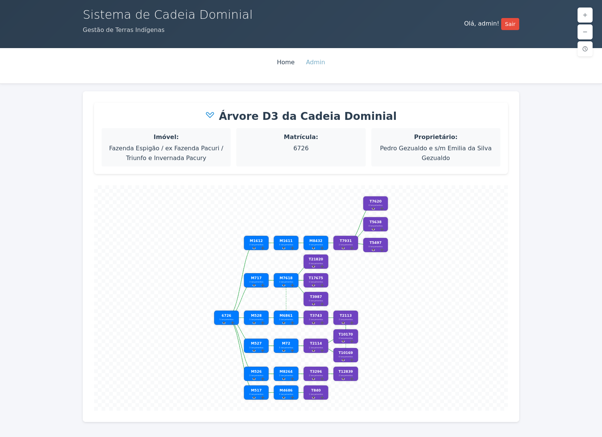

# Sistema de Cadeia Dominial

Sistema web para gestão e visualização de cadeias dominiais de terras indígenas, desenvolvido em Django.



## Documentação

Toda a documentação está organizada na pasta [`docs/`](docs/README.md):

- **Deploy e Produção**: Checklists, guias de deploy e configuração
- **Refatoração**: Documentação das melhorias implementadas
- **Cartórios**: Análise e planejamento da estrutura de cartórios
- **Planejamento**: Prioridades e estratégias de implementação

## Scripts de Teste

Scripts de teste e análise estão na pasta [`tests_scripts/`](tests_scripts/):

- Scripts de teste de funcionalidades
- Análise de estrutura de cartórios
- Testes de integração

## Versão Beta v1.0.0

Esta é a primeira versão beta do sistema, disponível para testes com clientes.

### Funcionalidades Implementadas

#### Gestão de Dados
- **TIs (Terras Indígenas)**: Cadastro e gestão de terras indígenas
- **Imóveis**: Registro de imóveis com matrícula, SNCR e SIGEF
- **Cartórios**: Base de dados de cartórios brasileiros
- **Pessoas**: Cadastro de proprietários e envolvidos
- **Documentos**: Gestão de matrículas e transcrições
- **Lançamentos**: Registro de averbações, registros e alterações

#### Visualização em Árvore
- **Diagrama Interativo**: Visualização da cadeia dominial em formato de árvore
- **Zoom e Pan**: Navegação fluida com controles de zoom
- **Cards Dinâmicos**: Tamanho ajustável baseado na quantidade de documentos
- **Conexões Visuais**: Linhas conectando documentos relacionados
- **Origens Identificadas**: Detecção automática de documentos de origem

#### Interface Moderna
- **Design Responsivo**: Adaptável a diferentes tamanhos de tela
- **Tema Consistente**: Interface unificada e profissional
- **Navegação Intuitiva**: Menu e botões organizados logicamente
- **Feedback Visual**: Efeitos de hover e transições suaves

#### Segurança
- **Autenticação**: Sistema de login/logout
- **Autorização**: Controle de acesso baseado em permissões
- **Validação**: Verificação de dados e integridade

## Tecnologias Utilizadas

- **Backend**: Django 5.2.1
- **Frontend**: HTML5, CSS3, JavaScript (Vanilla)
- **Banco de Dados**: SQLite (desenvolvimento)
- **Geolocalização**: GeoDjango (PostGIS)
- **Autocomplete**: Django Autocomplete Light

## Instalação

### Pré-requisitos
- Python 3.8+ (recomendado 3.11+)
- Git

### Método Recomendado: Usando uv (⚡ 10-100x mais rápido)

[uv](https://github.com/astral-sh/uv) é um instalador de pacotes Python extremamente rápido.

#### 1. Instale o uv
```bash
# Linux/Mac
curl -LsSf https://astral.sh/uv/install.sh | sh

# Windows (PowerShell)
powershell -c "irm https://astral.sh/uv/install.ps1 | iex"

# Ou via pip
pip install uv
```

#### 2. Clone e configure o projeto
```bash
# Clone o repositório
git clone https://github.com/transistir/CadeiaDominial.git
cd CadeiaDominial

# Crie ambiente virtual e instale dependências
uv venv
source .venv/bin/activate  # Linux/Mac
# .venv\Scripts\activate   # Windows

# Instale todas as dependências (super rápido!)
uv pip install -r requirements.txt

# Opcional: instale dependências de teste
uv pip install -r requirements-test.txt
```

#### 3. Configure o ambiente
```bash
# Copie o arquivo de exemplo
cp env.example .env

# Edite .env e configure pelo menos:
# - SECRET_KEY (gere uma chave única)
# - ADMIN_PASSWORD (senha forte)
```

#### 4. Inicialize o banco de dados
```bash
uv run python manage.py migrate
uv run python manage.py criar_tipos_documento
uv run python manage.py criar_tipos_lancamento
uv run python manage.py createsuperuser
```

#### 5. Inicie o servidor
```bash
uv run python manage.py runserver
```

**Pronto!** Acesse: http://localhost:8000

---

### Método Tradicional: Usando pip

<details>
<summary>Clique para ver instruções com pip tradicional</summary>

#### 1. Clone o repositório
```bash
git clone https://github.com/transistir/CadeiaDominial.git
cd CadeiaDominial
```

#### 2. Crie um ambiente virtual
```bash
python -m venv venv
source venv/bin/activate  # Linux/Mac
# venv\Scripts\activate   # Windows
```

#### 3. Instale as dependências
```bash
pip install -r requirements.txt
```

#### 4. Configure o ambiente
```bash
cp env.example .env
# Edite .env conforme necessário
```

#### 5. Inicialize o banco de dados
```bash
uv run python manage.py migrate
uv run python manage.py criar_tipos_documento
uv run python manage.py criar_tipos_lancamento
uv run python manage.py createsuperuser
```

#### 6. Inicie o servidor
```bash
uv run python manage.py runserver
```

</details>

---

### Executando Testes

```bash
# Instale dependências de teste (se ainda não instalou)
uv pip install -r requirements-test.txt

# Execute todos os testes
uv run pytest

# Execute com relatório de cobertura
uv run pytest --cov=dominial --cov-report=html

# Execute apenas testes unitários (rápido)
uv run pytest -m "not e2e"

# Execute testes específicos
uv run pytest dominial/tests/test_hierarquia_arvore_service.py

# Ou use Django test runner
uv run python manage.py test

# Visualize relatório de cobertura
open htmlcov/index.html  # macOS
xdg-open htmlcov/index.html  # Linux
```

## Como Usar

### Acesso ao Sistema
- URL: `http://localhost:8000`
- Use as credenciais do superusuário criado

### Fluxo Principal
1. **Cadastre uma TI** (Terra Indígena)
2. **Adicione Imóveis** à TI
3. **Cadastre Documentos** (matrículas/transcrições)
4. **Registre Lançamentos** nos documentos
5. **Visualize a Cadeia** na árvore dominial

### Visualização em Árvore
- Acesse um imóvel específico
- Clique em "Cadeia Dominial"
- Use os controles de zoom (+/-) para navegar
- Clique nos cards para ver detalhes
- Arraste para mover a visualização

## Estratégia de Versionamento

### Branches
- **`main`**: Código estável e testado
- **`develop`**: Desenvolvimento ativo
- **`feature/*`**: Novas funcionalidades
- **`hotfix/*`**: Correções urgentes

### Tags
- **`v1.0.0-beta`**: Primeira versão para testes
- **`v1.0.0`**: Versão estável (futuro)
- **`v1.1.0`**: Novas funcionalidades (futuro)

## Próximas Versões

### v1.1.0 (Planejado)
- [ ] Relatórios em PDF
- [ ] Exportação de dados
- [ ] Notificações por email
- [ ] Dashboard com estatísticas

### v1.2.0 (Planejado)
- [ ] API REST
- [ ] Integração com sistemas externos
- [ ] Módulo de auditoria
- [ ] Backup automático

## Contribuição

1. Faça um fork do projeto
2. Crie uma branch para sua feature (`git checkout -b feature/AmazingFeature`)
3. Commit suas mudanças (`git commit -m 'Add some AmazingFeature'`)
4. Push para a branch (`git push origin feature/AmazingFeature`)
5. Abra um Pull Request

## Suporte

Para dúvidas, sugestões ou problemas:
- Abra uma [Issue](https://github.com/transistir/CadeiaDominial/issues)
- Entre em contato com a equipe de desenvolvimento

## Licença

Este projeto está sob a licença MIT. Veja o arquivo [LICENSE](LICENSE) para mais detalhes.

---

**Desenvolvido pela equipe Transistir**