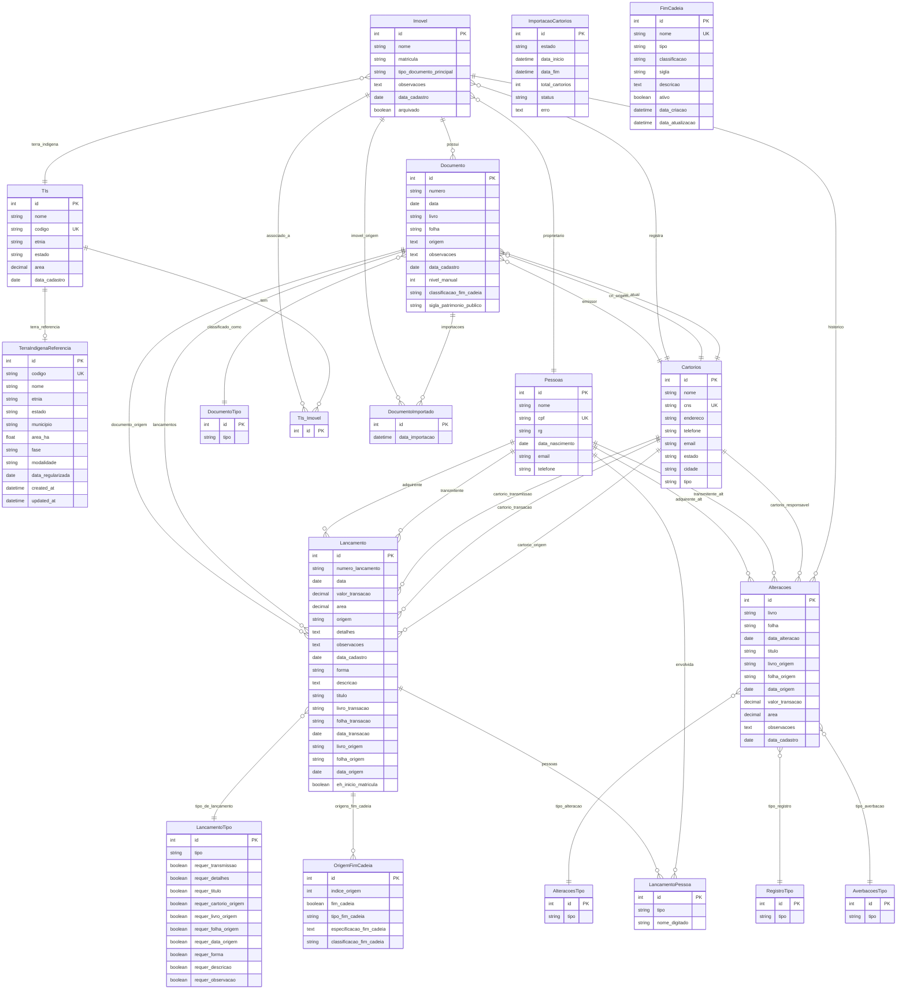

# Diagrama ERD — Cadeia Dominial

## Schema do Banco de Dados

## Legenda das Entidades

| Entidade | Descrição |
|----------|-----------|
| **Imovel** | Entidade central — imóveis registrados com matrícula única por cartório |
| **Documento** | Documentos (matrículas/transcrições) associados a um imóvel |
| **Lancamento** | Lançamentos da cadeia dominial (registros, averbações, início de matrícula) |
| **LancamentoPessoa** | Pessoas (transmitentes/adquirentes) associadas a lançamentos |
| **Pessoas** | Pessoas físicas/jurídicas envolvidas |
| **Cartorios** | Cartórios de Registro de Imóveis |
| **Alteracoes** | Alterações sobre imóveis (registros/averbações) |
| **TIs** | Terras Indígenas sobrepostas |
| **FimCadeia** | Tipos configuráveis de fim de cadeia dominial |
| **DocumentoImportado** | Rastreamento de documentos importados entre cadeias |

## Relacionamentos Principais

- **Imovel ↔ Documento**: 1:N — um imóvel pode ter múltiplos documentos
- **Documento ↔ Lancamento**: 1:N — um documento pode ter vários lançamentos
- **Lancamento ↔ LancamentoPessoa**: 1:N — um lançamento pode ter múltiplas pessoas
- **Imovel ↔ Alteracoes**: 1:N — um imóvel tem um histórico de alterações
- **Imovel ↔ TIs**: 1:N via `Imovel.terra_indigena_id` (FK direta para uma TI) + N:N via `TIs_Imovel` (junction) — a FK cobre a relação principal; o junction modela sobreposições históricas/opcional
- **Documento → Lancamento (documento_origem)**: cada Documento é o documento de origem de N Lancamentos (chain link) — FK `Lancamento.documento_origem_id` aponta para `Documento`
