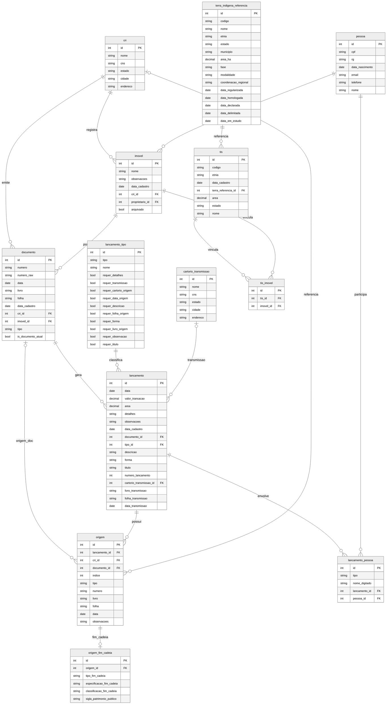

# Diagrama ERD — Cadeia Dominial

> **Status:** Este diagrama reflete o **design v2** (atual) consolidado em
> [`docs/db/SCHEMA_CONSOLIDATED.md`](../db/SCHEMA_CONSOLIDATED.md) e
> [`docs/db/erd-v2.mmd`](../db/erd-v2.mmd). Sincronizado em junho/2026 com o
> resultado do **T-100** (re-desenho do ERD a partir do blindspot review).
>
> **⚠ Phase 0 (BLOCKING):** seis decisões em
> [`docs/db/SCHEMA_DECISOES_PENDENTES.md`](../db/SCHEMA_DECISOES_PENDENTES.md)
> (Q1–Q6) podem alterar este schema antes do lock-in. Tarefa **T-001** em
> [`TASKS.md`](../TASKS.md).

## Schema do Banco de Dados (v2 — design atual)

## Legenda das Entidades

| Entidade | Descrição |
|----------|-----------|
| **cri** | Cartório de Registro de Imóveis (renomeado de `Cartorios`; sem coluna `tipo`) |
| **cartorio_transmissao** | Cadastro manual de cartórios usados em transmissão (separado de `cri`) |
| **pessoa** | Pessoas físicas/jurídicas envolvidas (renomeado de `Pessoas`) |
| **imovel** | Imóvel — representa a matrícula vigente. Quando a matrícula muda, cria-se um novo `imovel` |
| **documento** | Matrícula ou transcrição. `tipo` inline (`matricula` \| `transcricao`); `is_documento_atual` marca o documento vigente do imóvel |
| **lancamento_tipo** | Tipos de lançamento (`inicio_matricula` \| `registro` \| `averbacao`) + flags `requer_*` (UI/validação) |
| **lancamento** | Lançamento (registro/averbação/início de matrícula) sobre um `documento` |
| **lancamento_pessoa** | Pessoas (transmitente/adquirente) associadas a um lançamento (1:N por lançamento) |
| **origem** | Origem estruturada de um lançamento — substitui os campos legados `lancamento.origem` e `documento_origem_id`. Suporta múltiplas origens por lançamento via `indice` |
| **origem_fim_cadeia** | Detalhes de fim de cadeia para uma `origem` (1:1 opcional). Só existe quando `origem.tipo = 'fim_cadeia'` |
| **tis** | Terra Indígena |
| **tis_imovel** | Junção N:N entre `tis` e `imovel` (substitui `TIs_Imovel`) |
| **terra_indigena_referencia** | Dados de referência importados da FUNAI (read-only; não sujeito às mesmas regras de FK CASCADE) |

## Relacionamentos Principais

- **cri ↔ documento** — 1:N. Um CRI emite vários documentos.
- **cri ↔ imovel** — 1:N. Um CRI registra vários imóveis.
- **imovel ↔ documento** — 1:N. Um imóvel tem histórico de documentos; apenas **um** com `is_documento_atual = 1` (UNIQUE parcial).
- **pessoa ↔ imovel** — 1:N. Uma pessoa pode ser proprietária de vários imóveis.
- **documento ↔ lancamento** — 1:N. Um documento gera vários lançamentos.
- **lancamento ↔ lancamento_tipo** — N:1. Todo lançamento tem um tipo.
- **lancamento ↔ origem** — 1:N. Um lançamento pode ter várias origens (`indice` 0, 1, 2, … contíguos por `lancamento`).
- **origem ↔ origem_fim_cadeia** — 1:1 opcional. Apenas quando a origem é `fim_cadeia`.
- **origem → documento / cri** — N:1 opcional. Origem pode apontar para um documento (quando `tipo ∈ {matricula, transcricao}`) ou para um CRI (quando aplicável, ex.: `inicio_matricula`).
- **pessoa ↔ lancamento_pessoa ↔ lancamento** — N:N mediado por `lancamento_pessoa`. Múltiplas pessoas por lançamento (transmitente + adquirente).
- **cartorio_transmissao ↔ lancamento** — N:1 opcional. Cartório de transmissão manual (não confundir com `cri`).
- **tis ↔ imovel** — N:N via `tis_imovel` (substitui FK direta legada `Imovel.terra_indigena_id`).
- **tis ↔ terra_indigena_referencia** — N:1 opcional. TI pode referenciar dados oficiais da FUNAI.

## Composite Unique Constraints (DDL)

Declaradas em [`docs/db/SCHEMA_CONSTRAINTS.md`](../db/SCHEMA_CONSTRAINTS.md). Mermaid ERD não tem sintaxe nativa para `UNIQUE`, então ficam fora do diagrama:

- **documento** — `UNIQUE (cri_id, tipo, numero)` + `UNIQUE (imovel_id) WHERE is_documento_atual = 1` (parcial — garante **um** documento atual por imóvel)
- **lancamento** — `UNIQUE (documento_id, numero_lancamento)`
- **origem** — `UNIQUE (lancamento_id, indice)` (índices contíguos por lançamento)
- **origem_fim_cadeia** — `UNIQUE (origem_id)` (1:1 com `origem`)
- **tis_imovel** — `UNIQUE (tis_id, imovel_id)`

## Tabelas Removidas no v2

Presentes no schema Django legado, removidas em [`docs/db/SCHEMA_CONSOLIDATED.md` §2.1](../db/SCHEMA_CONSOLIDATED.md):

- `documento_tipo` — apenas 2 valores fixos; substituído por `documento.tipo` inline + CHECK
- `alteracoes` + `alteracoes_tipo` + `registro_tipo` + `averbacoes_tipo` — legado, migrado para `lancamento` + `documento`
- `documento_importado` — funcionalidade não usada (opcional: flag simples em `documento`)
- `fim_cadeia` (catálogo) — redundante; `origem_fim_cadeia` carrega essa informação
- `importacao_cartorios` — log administrativo; migrado para logs de aplicação
- `TIs_Imovel` → renomeado para `tis_imovel` (nomenclatura apenas)

## Fonte / Cross-reference

- Schema consolidado: [`docs/db/SCHEMA_CONSOLIDATED.md`](../db/SCHEMA_CONSOLIDATED.md)
- Constraints (DDL + regras condicionais): [`docs/db/SCHEMA_CONSTRAINTS.md`](../db/SCHEMA_CONSTRAINTS.md)
- Mermaid (tooling-friendly, sem prose): [`docs/db/erd-v2.mmd`](../db/erd-v2.mmd)
- Legenda compartilhada: [`docs/db/erd-v2-legend.md`](../db/erd-v2-legend.md)
- Blindspot review (27 issues, 10 P0): [`docs/SCHEMA_V2_BLINDSPOT_REVIEW.md`](../SCHEMA_V2_BLINDSPOT_REVIEW.md)
- Django legado (referência histórica): [`docs/legacy-django/03-database-models.md`](../legacy-django/03-database-models.md)
- Roadmap & tasks: [`TASKS.md`](../TASKS.md) — T-100 (re-desenho do ERD), T-101 (Drizzle schema)
