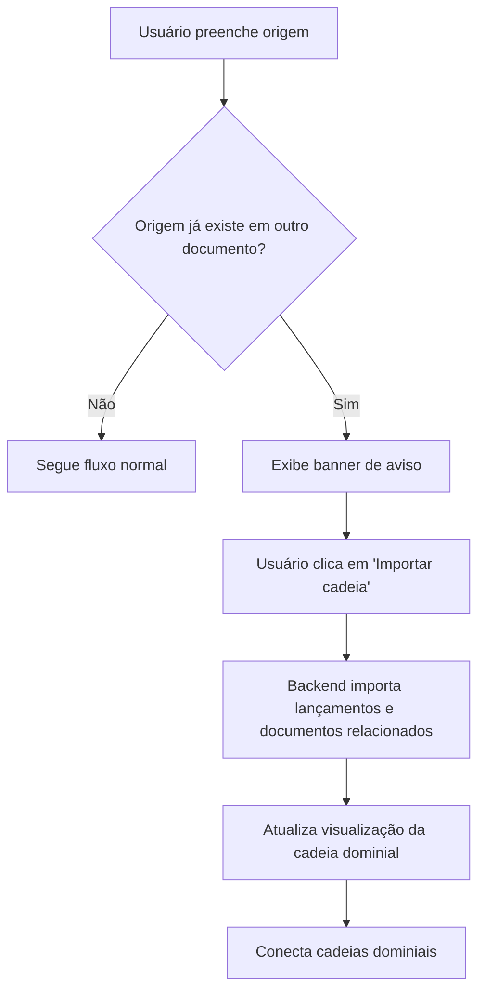

# Funcionalidade: Aviso e Importação de Cadeia Dominial Existente

## 📋 Visão Geral

**Objetivo:** Quando o usuário informar uma origem (matrícula/transcrição) que já existe em outro documento, o sistema deve:
1. Exibir um aviso (banner) informando que a origem já existe
2. Oferecer a opção de importar a cadeia dominial relacionada a essa origem
3. Conectar as cadeias dominiais de forma inteligente

## 🎯 Problema a Resolver

- **Cenário atual:** Usuário cadastra origem que já existe em outro documento
- **Problema:** Duplicidade de dados e cadeias dominiais desconectadas
- **Solução:** Detectar origem existente e oferecer importação da cadeia relacionada

## 🔄 Fluxo da Funcionalidade



## 🏗️ Arquitetura Técnica

### Backend - Novos Endpoints

#### 1. Verificação de Origem Existente
```python
# dominial/views/api_views.py
@login_required
def verificar_origem_existente(request):
    """
    Verifica se uma origem já existe em outro documento
    """
    origem = request.POST.get('origem')
    documento_atual_id = request.POST.get('documento_id')
    
    # Buscar documento com mesma origem em outro documento
    documento_existente = Documento.objects.filter(
        numero=origem,
        cartorio=cartorio
    ).exclude(id=documento_atual_id).first()
    
    if documento_existente:
        return JsonResponse({
            'existe': True,
            'documento_existente': {
                'id': documento_existente.id,
                'numero': documento_existente.numero,
                'tipo': documento_existente.tipo.tipo,
                'cartorio': documento_existente.cartorio.nome
            }
        })
    
    return JsonResponse({'existe': False})
```

#### 2. Importação de Cadeia Dominial
```python
# dominial/services/cadeia_importacao_service.py
class CadeiaImportacaoService:
    @staticmethod
    def importar_cadeia_dominial(origem_documento_id, documento_destino_id):
        """
        Importa a cadeia dominial de um documento de origem para um documento de destino
        """
        # 1. Buscar documento de origem
        # 2. Identificar todos os lançamentos relacionados
        # 3. Identificar documentos conectados
        # 4. Copiar/relacionar ao documento de destino
        # 5. Manter hierarquia e conexões
        pass
```

### Frontend - Componentes

#### 1. Banner de Aviso
```html
<!-- templates/dominial/components/_banner_origem_existente.html -->
<div id="banner-origem-existente" class="alert alert-warning" style="display: none;">
    <div class="alert-content">
        <div class="alert-icon">⚠️</div>
        <div class="alert-message">
            <strong>A origem informada já existe em outro documento.</strong><br>
            <span>Você pode importar a cadeia dominial relacionada a essa origem para este documento.</span>
        </div>
        <div class="alert-actions">
            <button class="btn btn-primary btn-sm" onclick="importarCadeiaDominial()">
                Importar cadeia dominial
            </button>
            <button class="btn btn-secondary btn-sm" onclick="visualizarCadeiaExistente()">
                Visualizar cadeia existente
            </button>
        </div>
    </div>
</div>
```

#### 2. JavaScript para Integração
```javascript
// static/dominial/js/origem_existente.js
function verificarOrigemExistente(origem, documentoId) {
    $.ajax({
        url: '/dominial/api/verificar-origem-existente/',
        method: 'POST',
        data: {
            origem: origem,
            documento_id: documentoId,
            csrfmiddlewaretoken: getCsrfToken()
        },
        success: function(response) {
            if (response.existe) {
                exibirBannerOrigemExistente(response.documento_existente);
            } else {
                ocultarBannerOrigemExistente();
            }
        }
    });
}

function importarCadeiaDominial() {
    // Implementar chamada para importação
    $.ajax({
        url: '/dominial/api/importar-cadeia-dominial/',
        method: 'POST',
        data: {
            origem_documento_id: documentoExistenteId,
            documento_destino_id: documentoAtualId,
            csrfmiddlewaretoken: getCsrfToken()
        },
        success: function(response) {
            if (response.sucesso) {
                mostrarMensagemSucesso('Cadeia dominial importada com sucesso!');
                atualizarVisualizacaoCadeia();
            }
        }
    });
}
```

## 📝 Mensagens para o Usuário

### Banner de Aviso
```
⚠️ A origem informada já existe em outro documento.

Você pode importar a cadeia dominial relacionada a essa origem para este documento.

[Importar cadeia dominial] [Visualizar cadeia existente]
```

### Mensagens de Sucesso/Erro
- **Sucesso:** "✅ Cadeia dominial importada com sucesso!"
- **Erro:** "❌ Erro ao importar cadeia dominial. Tente novamente."
- **Confirmação:** "Tem certeza que deseja importar a cadeia dominial? Esta ação não pode ser desfeita."

## 🗄️ Estrutura de Dados

### Tabelas Envolvidas
- `dominial_documento` - Documentos de origem e destino
- `dominial_lancamento` - Lançamentos relacionados
- `dominial_pessoas` - Pessoas envolvidas nos lançamentos
- `dominial_cartorios` - Cartórios dos documentos

### Relacionamentos a Considerar
- Documento → Lançamentos
- Lançamento → Pessoas (transmitente/adquirente)
- Documento → Cartório
- Lançamento → Documento de origem (campo `documento_origem`)

## ⚠️ Pontos de Atenção

### Validações Necessárias
1. **Evitar duplicidade:** Não criar documentos/lançamentos duplicados
2. **Manter integridade:** Preservar relacionamentos e hierarquia
3. **Permissões:** Verificar se usuário tem acesso aos documentos
4. **Ciclos:** Evitar criar ciclos na cadeia dominial

### Casos Especiais
- **Origem em múltiplos documentos:** Qual importar?
- **Conflitos de dados:** Como resolver diferenças?
- **Rollback:** Como desfazer importação se necessário?

## 🧪 Cenários de Teste

### Cenário 1: Origem Simples
1. Usuário cadastra documento A com origem M123
2. Usuário cadastra documento B com origem M123
3. Sistema detecta e oferece importação
4. Usuário importa cadeia de A para B

### Cenário 2: Cadeia Complexa
1. Documento A tem lançamentos com origens M123, M124
2. Documento B tem origem M123
3. Sistema oferece importar toda cadeia de A
4. Resultado: B conecta com A e todos os documentos relacionados

### Cenário 3: Conflitos
1. Documento A e B têm origens diferentes mas relacionadas
2. Sistema detecta possível conflito
3. Oferece opções de resolução

## 📋 Checklist de Implementação

### Backend
- [ ] Criar endpoint `verificar_origem_existente`
- [ ] Criar endpoint `importar_cadeia_dominial`
- [ ] Implementar `CadeiaImportacaoService`
- [ ] Adicionar validações de segurança
- [ ] Implementar logs de importação
- [ ] Criar testes unitários

### Frontend
- [ ] Criar componente banner de aviso
- [ ] Implementar JavaScript de verificação
- [ ] Implementar JavaScript de importação
- [ ] Adicionar estilos CSS
- [ ] Integrar com formulários existentes
- [ ] Criar testes de interface

### Integração
- [ ] Testar fluxo completo
- [ ] Validar performance
- [ ] Documentar API
- [ ] Treinar usuários

## 🚀 Próximos Passos

1. **Fase 1:** Implementar verificação de origem existente
2. **Fase 2:** Criar banner de aviso
3. **Fase 3:** Implementar importação básica
4. **Fase 4:** Adicionar validações avançadas
5. **Fase 5:** Testes e refinamentos

## 📚 Referências

- [Documentação Django](https://docs.djangoproject.com/)
- [Padrões de API REST](https://restfulapi.net/)
- [Convenções de Nomenclatura](COMMIT_CONVENTION.md)

---

**Criado em:** 08/07/2025  
**Última atualização:** 08/07/2025  
**Responsável:** Equipe de Desenvolvimento  
**Status:** Planejado 